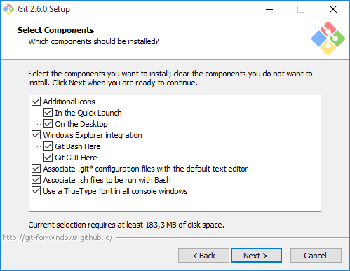
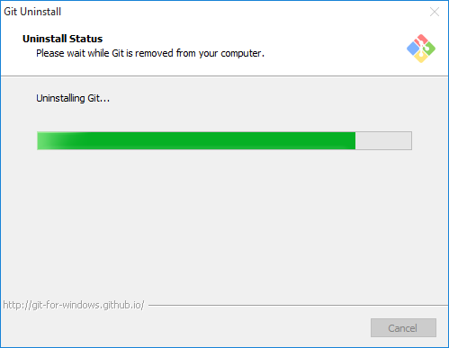
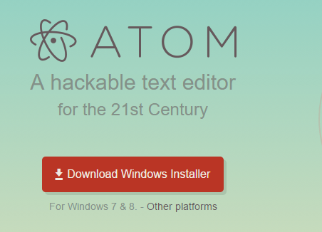

# alu4543.github.io 
## Autor : MohammedMahrach
## alu0100777475 / alu4543
Personal student repository

Tareas Iniciales
================

1. Darse de alta en la comunidad Google + ULL-ETSII-SYTW-1516
----------------------------------------------------------------------
    1. Solicitud de alta
        * Para hacerlo, entra a
[*http://mail.ull.edu.es*](http://mail.ull.edu.es)

> una vez allí date de alta en g+ (si no lo has hecho) siguiendo el enlace en +me o +yo en la parte superior derecha

2. Instala node.JS
-----------------
    1. Instalación de Node.js
        * Si estás en Windows sigue las instrucciones en GitHub para Windows
[*https://nodejs.org/en/*](https://nodejs.org/en/)

    2. Comprueba que npm funciona
        * Desde la consola comprobamos si la utilidad de la linea de comandos npm funciona.

    3. Instala express
        * Para instalar express tenemos que tener el npm iniciado.

~~~
\$ mkdir myapp

\$ cd myapp

\$ npm init

\$ npm install express --save
~~~

3. Pon tu foto en tu perfil del campus virtual
----------------------------------------------

4. Instala Git.
---------------
    1. GitHub para Windows
        * Si estás en Windows sigue las instrucciones en GitHub para Windows

[*https://git-for-windows.github.io*](https://git-for-windows.github.io)

        * Descarga e instala el fichero : Git-2.6.0-64-bit.exe

 

 

5. Abre una cuenta en GitHub si no la tienes
--------------------------------------------
> Ya tenemos una cuenta publica abierta y esta en el siguiente enlace:

[*https://github.com/alu4543*](https://github.com/alu4543)

6. Si dispones de un Mac o Windows instala GitHub App
------------------------------------------------------
> Desde el siguiente enlace se puede Descargar y instalar GitHub Para Windows Desktop.

[*https://desktop.github.com*](https://desktop.github.com)

7. Instala Atom, el editor desarrollado por GitHub
-------------------------------------------------
    1. Descargar el instalador
        * Desde el siguiente enlace se puede Descargar y instalar atom Para Windows Desktop.

[*https://atom.io*](https://atom.io)

    2. Prueba
        * Ya tenemos el atom instalado!

8. cloud9 c9.io
---------------
        * Abre una cuenta en c9.io (cloud9). Vincula tu cuenta de GitHub con c9.

9. Instalar el traductor pandoc para traducir Markdown a HTML.
-------------------------------------------------------------

        * Para instalar en Windows:

[*https://github.com/jgm/pandoc/releases/tag/1.15.0.6*](https://github.com/jgm/pandoc/releases/tag/1.15.0.6)

        * Pandoc Getting started.

[*http://pandoc.org/getting-started.html/*](http://pandoc.org/getting-started.html)

